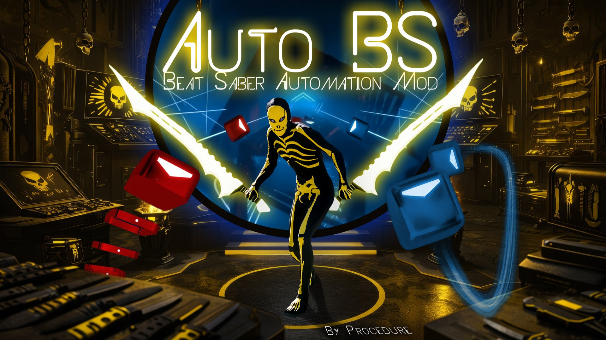
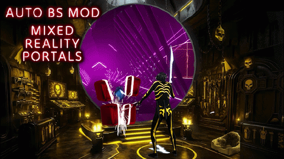
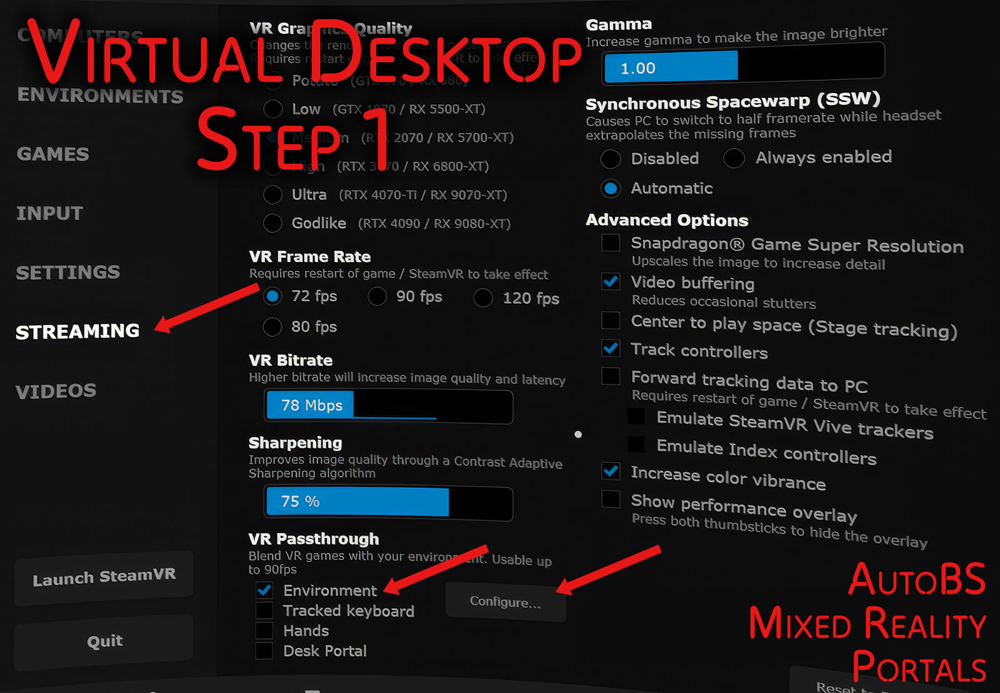
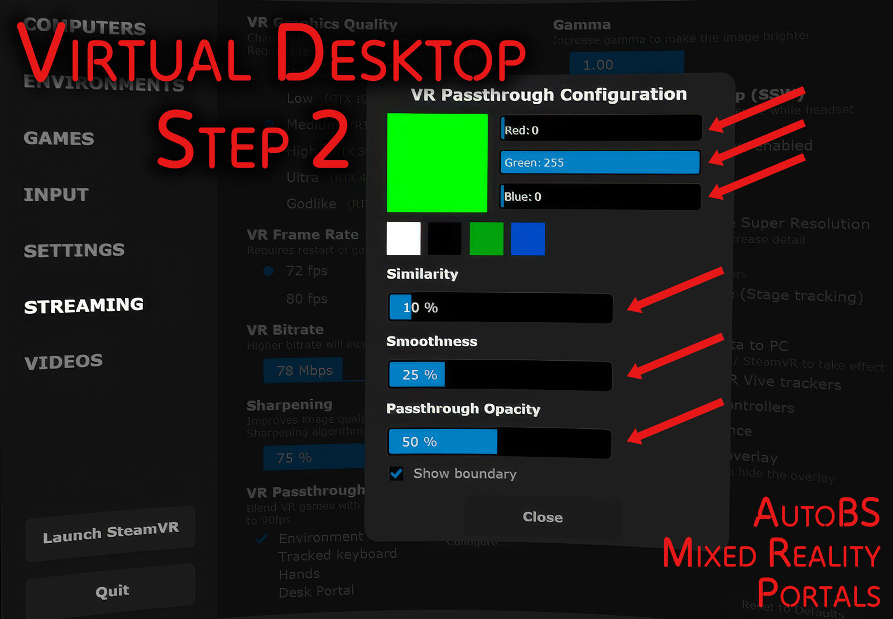

# AutoBS — Beat Saber Automation Mod
## Mixed Reality Portals 
## Arcitect Arc + Chain Maker, Auto Lights, Auto Walls
## Auto NJS Fixer with Live Tuning
## Auto Difficulty Reducer
## And 360fyer!

## For Beat Saber PC Version v1.42

A Beat Saber mod that adds floating Mixed Reality Portals (requires the `Virtual Desktop` app) and can automatically convert standard maps into 360° maps. It also enhances maps by generating arcs, chains, lighting events, and a show of `mapping extensions` walls. Most of these features work on existing, non‑generated maps as well—so you can add arcs, walls, and more to standard maps. Tune the Volume, Note Speed and Note spawn distance live during gameplay with your controllers. Auto Difficulty Reducer, along with automatic note speed and spawn distance adjustments, can turn even Expert++ maps into maps a toddler can play :) This mod includes a Camera Alignment Tool to aid in mixed reality recording and can also clean up small problems with `Beat Sage` maps.

NOTE: This mod can be used to output and convert to v2, v3, and v4 JSON beatmap `.dat` files containing all generated features. It can also be used to help line up a virtual and real world camera for mixed reality capture along with the `CameraPlus` mod. See the end of this readme file below.

The original 360fyer mod was created by the genius CodeStix. https://github.com/CodeStix/
I have updated the mod since it has been dormant for a long time. Now compatible with Arcs + Chains. Ultra customizable from angle size to rotation frequency for easy 360 or for a super challenging workout. Note: Vivify maps and many complex Noodle maps are currently incompatible and disabled for 360fyer.

## Installation

- Install this mod by downloading `AutoBS.dll` from the Releases tab: https://github.com/procedure1/autobs/releases and placing it in the `Plugins/` directory of your modded Beat Saber installation.
- Requires `CustomJSONData` mod (via BSManager or ModAssistant)
- COMING SOON: Install this mod using BSManager or ModAssistant.
- Recommended: install Kylemc's `Mapping Extensions` mod if you want full wall customization.
- Aeroluna's `Technicolor` mod is awesome with 360fyer

## Mixed Reality Portals
Create circular or rectangular portals to see Beat Saber through a floating mixed reality window. There is a ring-style portal for 360 maps.

- NOTE: Requires `Virtual Desktop App`. Turn on Streaming > VR Passthrough > Environment checkbox. 

Configure Virtual Desktop's VR Passthrough setting: Pure Green Color (red:0, green:255, blue:0), Similarity: 10%, Smoothness: 25%, Opacity: 50%. These settings work well for me but feel free to play with them.
Its best to use custom color schemes to avoid pure green in your maps. (The AutoBS config file has 'MixedRealityGreenScreenColor' which lets you change the passthrough color if you prefer another color besides green.)
Video tutorial link coming soon. 

| | |
|--|--|
|  |   |

## Arcitect Arc + Chain Maker

`Arcitect` automatically adds arcs and chains to maps that don't have them. Not as good as a human, of course! But better than nothing. Long-duration chains are available, but the slices can become difficult to hit when chains get too long. ***HINT: Set `Arc Rotation Mode` to `No Restrictions` for more challenging arcs.***

- NOTE: Arcs and Chains added to a map would change the scoring, so I have disabled score submission for maps with generated chains.

## 360fyer

`360fyer` will take a standard map and create a new map with rotation events. After installation, every beatmap will have the 360-degree game mode enabled. Just choose 360 when you select a song. The level will be generated once you start the level.
The algorithm is completely deterministic and does not use random chance; it generates rotation events based on the notes in the Standard beatmap (the base map can be changed in the menus from "Standard" to "OneSaber", "NoArrows", "90Degree", or even "360Degree" as well).

Wireless headset users can use the `Wireless 360` menu setting, which has no rotation limits and fewer tendencies to reverse direction. Tethered headset users have rotation-limiting settings to make sure they don’t ruin the cable by rotating too much. You can also use these settings if your play space is limited (for example, you could limit rotations to 150° or 180° if you want to face forward only).

Rotation size and frequency can be adjusted in the menu, and headset FOV limits can be set so that rotations don't move outside your peripheral vision.

***HINT: For challenging rapid, large-angle rotations, go to the `Rotation` settings section and crank up `Rot Speed Multiplier`, `Min Rotation Size` and/or `Max Rotation Size`. If you set `Max Rotation Size` > 30, then you must set `FOV` to 90 or greater (otherwise 45° rotations will be removed. Higher than 90° FOV on a Quest will allow rotations you cannot see).***

***Option 1: Raise `Rot Speed Multiplier` to your desired value and increase `Min Rotation Size` to 30. leave `Max Rotation Size` and `FOV` at default. This creates fast frequent rotations all at 30°.*** 

***Option 2: I like to use `Rot Speed Multiplier` = 1.6x, `Min Rotation Size` = 15 (default), `Max Rotation Size` = 45 and `FOV` = 90 for my Quest3 headset. This creates fast frequent rotations with the occasional big 45° rotation.***

***Option 3: To go even bigger, use Option 2 and set `Min Rotation Size` = 30. You will likely need to reduce `Rot Speed Multiplier` quite a bit. You can start trimming around the edges of your peripheral vision with `FOV Time Window`. Increase it a bit to reduce a little of the large jumps at the periphery.***

## Auto Light Generator

`Auto Lights` automatically adds basic lighting events to maps that don't have them. This only works older environments before Weave and the 360 environment. Modern GLS environments are not supported. Thanks to Loloppe (based on their ChroMapper-AutoMapper)! I made many changes so anything crappy is my fault :) The 360 environment is very low-key with dim, narrow lasers compared to modern environments. Since the 360 environment doesn't work with v3 `GLS` lights (Group Lighting System), new `OST maps` converted to 360 have no lights in the 360 environment without `Auto Lights`. You can choose to add `boost` lighting events as well. And 360-environment lasers are fat and bright to enliven the boring 360 environment. Human-crafted lights are best, machine-made lights are OK, no lights suck! (I am considering adding automatic lighting for GLS environments as well in the future.)

- Note: Aeroluna's `Technicolor` mod is awesome with 360fyer if you play a lot of 360 maps.

## Auto Wall Generator

The original 360fyer generated awesome walls. This version adds `Generated Extension Walls` walls and creates tons of walls and particle walls to help enliven the boring 360 environment. But you can add this to any environment. This is designed to work with `Mapping Extensions` mod. Many of the walls types will still work in a modified and reduced way without the mod.

- NOTE: Dense walls can be claustrophobic and distracting, but you can disable them, reduce them, or move them away from your play space if you like (using `Min Distance` for each wall type).
- NOTE: Scoring is disabled when using auto walls.

## Auto NJS Fixer — with Live Controller Tuning

Thanks to Kylemc for allowing me to work from their original code! The original `NJS Fixer` is designed to be used on a per-song basis more or less (IMHO). `Auto NJS Fixer` is designed to “set it and forget it.” 360 maps with rapid turns prefer a long note spawn distance, hence the need for this. You can choose `Preserve Travel Time` if you want to keep the mapper’s intended duration of travel, reaction time and perceived note speed while letting you change the note spawn distance. Or you can use `Set Note Speed` to set your favorite speed and spawn distance; this works well for most songs. (But large speed changes don't work well on maps with high note density.) Overrides Beat Saber PLAYER OPTIONS > JUMP DURATION TYPE and OFFSET. Separately or additionally, change the NJS (and/or JD) live during gameplay using your controllers! Tune every map to your preference on the fly.

- NOTE: If settings cause the note speed to change from the original map, score submission will be disabled. Also, `Auto NJS Fixer` is disabled by the original `NJS Fixer` and `JDFixer` if they are installed (enabled or not). Also, for maps with NJS events, a specified note spawn distance will vary when note speed varies. 

- NOTE: This gets wonky for large NJS or JD changes.

## Live Volume Control
I hate reaching for my headset volume button during gameplay every other song to bump up a quiet song. Now you can do it with your controller thumbstick or buttons during gameplay with ease.

## Auto Difficulty Reducer
And yet again, thanks to Kylemc for allowing me to work from their original code! This new version is automated to reduce difficulty on all maps above the note per second threshold that a user sets. It is also designed to attempt to keep a map's rhythmic structure as much as possible. It's not perfect! This reduces difficulty by removing notes. Sorry to the genius mappers out there! But at least this gives more toddlers like me a chance to play your awesome maps...

- NOTE: Altered maps have scoring disabled.

## Beat Sage Cleaner

Can remove some impossible note combinations common with `Beat Sage`-generated maps. It shortens long crouch walls and removes stray notes (notes many seconds away from the main body of song notes) at the start or end of maps.

- NOTE: Altered maps have scoring disabled.

## Camera Alignment Tool for Mixed Reality Recording

Mixed Reality Portals allow a new way (I think) to help record mixed reality videos using green screen to place your physical body into the virtual Beat Saber environment. For your virtual sabers to line up with your hands and controllers in the real world, your virtual camera must line up perfectly with your real camera and this tool can help in that difficult process. [See the WIKI.](https://github.com/procedure1/AutoBS/wiki/Camera-Alignment-Tool-for-Mixed-Reality-Recording)

## Check out the full [WIKI](https://github.com/procedure1/AutoBS/wiki) for more details.

## Todo

Modern GLS lighting and environment support
